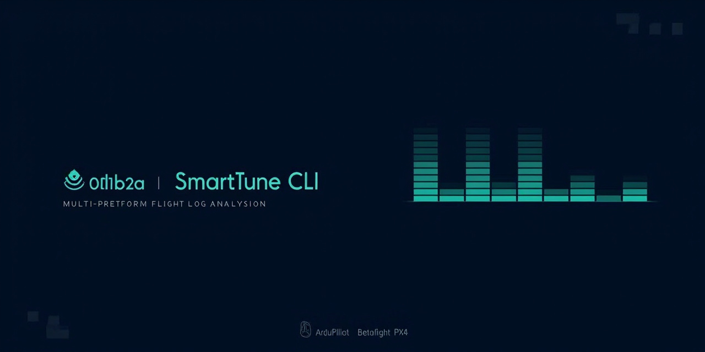

<p align="center">
  
</p>

<p align="center">
  <strong>Flight log analysis, designed for AI agents</strong><br>
  Machine-readable output · Structured data · No GUI · Zero cloud
</p>

<p align="center">
  <a href="#install"></a>
  <a href="https://opensource.org/licenses/MIT"></a>
  <a href="https://www.python.org"></a>
  <a href="https://github.com/raylanlin/smarttune-cli/actions"></a>
</p>

<p align="center">
  ArduPilot · Betaflight · PX4<br>
  <a href="#quick-start">Quick Start</a> ·
  <a href="#for-agents">For Agents</a> ·
  <a href="#commands">Commands</a> ·
  <a href="#output-formats">Output Formats</a> ·
  <a href="#architecture">Architecture</a>
</p>

---

> **SmartTune is a tuning CLI built for the age of AI-assisted flight log analysis.**  
> Every output is structured. Every command is deterministic. No TUI, no blocking prompts, no interactive workflows that break when called by an agent. It was designed from day one to be invoked by LLM agents as a tool, and consumed by humans through the same pipeline.

---

## Install

```bash
pip install git+https://github.com/raylanlin/smarttune-cli.git

# With all platform extras
pip install "git+https://github.com/raylanlin/smarttune-cli.git#egg=smarttune[all]"

# Development
git clone https://github.com/raylanlin/smarttune-cli.git
cd smarttune-cli
pip install -e ".[dev,all]"
```

> Requires Python 3.9+

---

## For Agents

SmartTune was designed specifically for **LLM agent tool-calling workflows**. Every aspect of the CLI follows agent-friendly principles:

| Principle | Implementation |
|-----------|---------------|
| **Deterministic output** | No interactive prompts, no TUI, no progress bars when piped to files. Same input → same output. |
| **Structured by default** | JSON output via `--format json`. No parsing fragile ANSI-escaped terminal dumps. |
| **Self-describing** | `stune platforms` lists available adapters. Error codes are standardized (E10xx–E50xx). Exit codes are meaningful. |
| **Fail-fast & isolated** | Single-module failure doesn't abort the full analysis. Each module gets its own try/except block. |
| **Config-free** | Zero config files needed. Everything is flags or auto-detected. No env vars required. |
| **Offline-first** | No network calls. No API keys. No rate limits. Safe for isolated/air-gapped environments. |
| **Machine-recommendable** | Tuning suggestions include confidence scores and reasoning, not just parameter values. Agents can weigh multiple recommendations. |

### What agents can do with SmartTune

- **Batch analysis** — analyze hundreds of logs with a loop; JSON output per file
- **Auto-tuning** — feed recommendations back into a flight controller via MAVLink or CLI
- **Fleet monitoring** — aggregate vibration/PID metrics across multiple aircraft
- **CI/CD integration** — run `stune analyze` as part of a pre-flight validation pipeline
- **Collaborative diagnosis** — have the agent compare logs from before/after a crash

---

## Quick Start

```bash
# Full analysis (auto-detect platform)
stune analyze -i flight.bin

# JSON output for agent consumption
stune analyze -i flight.bin --format json

# With charts (human-friendly)
stune analyze -i flight.bbl --visual

# Per-module deep dive
stune pid -i flight.bin -a roll --visual
stune fft -i flight.bin --visual
stune magfit -i flight.bin
stune sysid -i flight.bin -a pitch
stune hardware -i flight.bin

# Export to Markdown report
stune analyze -i flight.bin --format markdown -o report.md

# List supported platforms
stune platforms
```

---

## Output Formats

SmartTune supports multiple output formats, each designed for a specific consumption mode:

| Format | Use Case | Example |
|--------|----------|---------|
| **Terminal** | Human inspection in the shell | `stune analyze -i flight.bin` |
| **JSON** | Agent/script consumption | `stune analyze -i flight.bin --format json` |
| **Markdown** | Reports, READMEs, documentation | `stune analyze -i flight.bin --format markdown -o report.md` |
| **HTML** | Visual reports with embedded charts | `stune analyze -i flight.bin --visual --format html` |

### JSON output example

```json
{
  "platform": "ArduPilot",
  "timestamp": "2026-05-03T22:30:00",
  "pid": {
    "roll": {
      "rating": "GOOD",
      "confidence": 0.87,
      "kp": {"current": 0.12, "recommended": 0.14, "reason": "Slight oscillation at 8 Hz"},
      "ki": {"current": 0.05, "recommended": 0.05, "reason": "No steady-state error"},
      "max_overshoot_pct": 8.2,
      "rise_time_ms": 85,
      "settling_time_ms": 210
    }
  },
  "fft": {
    "vibration": {
      "level_rms": 2.1,
      "grade": "EXCELLENT"
    },
    "peaks": [
      {"freq_hz": 47.5, "magnitude_db": -12.3, "source": "propeller"}
    ]
  }
}
```

---

## Commands

### `stune analyze`

Full-spectrum analysis: PID + FFT + MagFit + hardware — all in one pass.

```bash
stune analyze -i flight.bin                           # Auto-detect
stune analyze -i flight.bbl --platform betaflight      # Force platform
stune analyze -i flight.bin --visual                   # With charts
stune analyze -i flight.bin --format json              # Machine-readable
stune analyze -i flight.bin -o report.md               # Export
```

### `stune pid`

PID step-response analysis with per-axis tuning recommendations.

```bash
stune pid -i flight.bin                                # All axes
stune pid -i flight.bin -a roll                        # Single axis
stune pid -i flight.bbl --visual                       # Betaflight
```

### `stune fft`

Frequency-domain vibration analysis with notch filter suggestions.

```bash
stune fft -i flight.bin                                # Full spectrum
stune fft -i flight.bin --visual                       # With spectrum plot
```

### `stune magfit`

Magnetometer calibration — hard/soft iron offset, coverage, field strength.

```bash
stune magfit -i flight.bin                             # ArduPilot only
```

### `stune sysid`

ARX system identification — natural frequency and damping ratio.

```bash
stune sysid -i flight.bin -a roll                      # Single axis
stune sysid -i flight.bin -a pitch --na 4 --nb 3       # Custom order
```

### `stune hardware`

Full hardware configuration report: firmware version, sensors, battery, parameters.

```bash
stune hardware -i flight.bin
stune hardware -i flight.bbl
```

### `stune filter`

Filter chain analysis with Bode plots.

```bash
stune filter -i flight.bin --gyro-filter 40 --visual
stune filter -i flight.bin --auto                     # Auto-derive from params
```

### `stune platforms`

List all available platform adapters and their capabilities.

```bash
stune platforms
```

---

## Supported Platforms

| Platform | Log Format | Parser | Status |
|----------|-----------|--------|--------|
| **ArduPilot** | `.bin` / `.log` (DataFlash) | pymavlink | ✅ Full support |
| **Betaflight** | `.bbl` / `.bfl` (Blackbox) | Pure Python | ✅ Full support |
| **PX4** | `.ulg` (ULog) | pyulog | 🔲 Coming in v2.x |

### Auto-Detection

SmartTune identifies your log format from file headers — no `--platform` flag needed:

| Bytes | Platform |
|-------|----------|
| `0xA3 0x95` | ArduPilot DataFlash |
| `H Product:Blackbox` | Betaflight Blackbox |
| ULog magic | PX4 ULog |

---

## Architecture

```
┌─────────────────────────────────────────────┐
│  CLI Layer                                   │
│  stune analyze / pid / fft / ...            │
│  --format json / markdown / html / terminal  │
└──────────────────┬──────────────────────────┘
                   │
┌──────────────────▼──────────────────────────┐
│  Platform Adapter Layer                      │
│  ArduPilot · Betaflight · PX4               │
│  Parsers → FlightData (unified IR)          │
└──────────────────┬──────────────────────────┘
                   │
┌──────────────────▼──────────────────────────┐
│  Analysis Engine                             │
│  PID / FFT / SysID / MagFit / Filter / HW   │
│  BF: Feedforward · RPM Filter · D-term      │
│  Platform-agnostic analyzers                │
└──────────────────┬──────────────────────────┘
                   │ AnalysisResult + ParamRef
┌──────────────────▼──────────────────────────┐
│  Knowledge Base (6-layer deep merge)         │
│  common → platform → user → Pro             │
│  JSON-based rules — inspectable & editable   │
└──────────────────┬──────────────────────────┘
                   │
┌──────────────────▼──────────────────────────┐
│  Output Layer                                │
│  Terminal (Rich) / JSON / Markdown / HTML    │
│  ParamRef → platform-native parameter names  │
└─────────────────────────────────────────────┘
```

---

## Knowledge Base

A 6-layer deep-merge rule engine powers all tuning recommendations. Each layer overrides the previous:

| # | Layer | Location | Editable |
|---|-------|----------|----------|
| 1 | Common physics rules | `smarttune/knowledge/rules/common/` | ❌ Built-in |
| 2 | Platform rules | `smarttune/knowledge/rules/{platform}/` | ❌ Built-in |
| 3 | User common | `~/.smarttune/knowledge/common/` | ✅ |
| 4 | User platform | `~/.smarttune/knowledge/{platform}/` | ✅ |
| 5 | Pro common | `smarttune-knowledge-pro` (optional) | 🔒 |
| 6 | Pro platform | `smarttune-knowledge-pro` (optional) | 🔒 |

Rules are standard JSON files. Add a file, restart the command, and the engine picks it up. No compilation, no database, no setup.

---

## Development

```bash
# Install with dev dependencies
pip install -e ".[dev,all]"

# Run tests
pytest tests/ -v                              # 96 tests, 1.5s
pytest tests/test_bbl_parser.py -v            # BBL parser only
pytest tests/test_betaflight_analyzers.py -v  # BF-specific analyzers

# Lint
ruff check smarttune/
black --check smarttune/
```

### Adding a New Platform

1. **Create adapter** — Subclass `PlatformAdapter`, implement `parse()`, `detect()`, `map_param_to_platform()`
2. **Add knowledge rules** — Drop JSON files in `smarttune/knowledge/rules/{platform}/`
3. **Register** — Use `@register` decorator

```python
@register
class MyPlatform(PlatformAdapter):
    name = "myplatform"
    ...
```

`stune platforms` will auto-discover it.

---

## For Humans

Yes, the terminal output is also beautiful. Rich-powered tables, progress bars, color-coded diagnostics — everything you'd expect from a modern CLI. But the architecture underneath is agent-first.

```bash
# Human-friendly terminal output (default)
stune analyze -i flight.bin

# Same data, machine-parseable
stune analyze -i flight.bin --format json | jq '.pid.roll.rating'
```

---

## Roadmap

| Phase | Content | Status |
|-------|---------|--------|
| v1.x | ArduPilot full support | ✅ |
| v2.0 Phase 1 | Multi-platform architecture | ✅ |
| v2.0 Phase 2 | Betaflight BBL parser + analytics | ✅ |
| v2.x | PX4 ULog adapter | 🔲 |
| v3.0 | Tool-calling manifest, plugin system, web UI | 🔲 |

---

## Author

**Raylan LIN** — [@raylanlin](https://github.com/raylanlin)

Built and maintained by a pilot who trusts agents more than checklists.

---

## License

MIT — see [LICENSE](LICENSE) for details.

`smarttune-knowledge-pro` is a separate closed-source package with a proprietary license.
