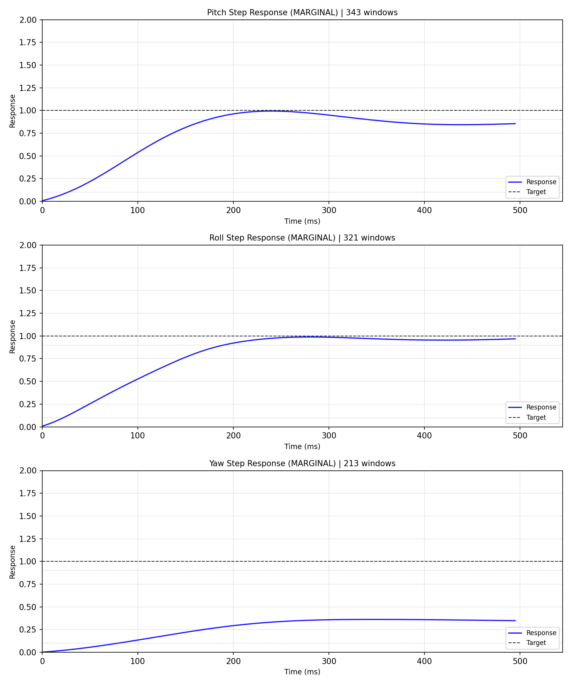
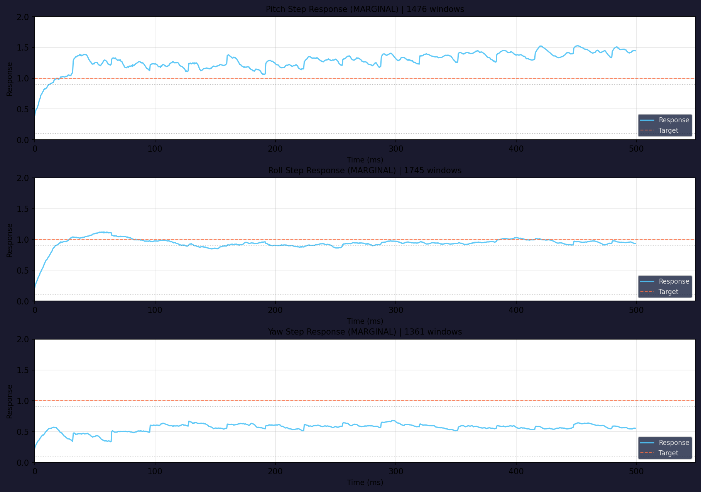

<p align="center">
  
</p>

<p align="center">
  <strong>Offline flight log analysis, built agent-first from day one</strong><br>
  One command from raw log to tunable PID/FFT/MagFit parameters — no special flights needed
</p>

<p align="center">
  <a href="https://github.com/raylanlin/smarttune-cli/releases"></a>
  <a href="https://opensource.org/licenses/MIT"></a>
  <a href="https://www.python.org"></a>
  <a href="https://github.com/raylanlin/smarttune-cli/actions"></a>
</p>

<p align="center">
  ArduPilot · Betaflight · PX4<br>
  <a href="#quick-start">Quick Start</a> ·
  <a href="#for-agents">For Agents</a> ·
  <a href="#commands">Commands</a> ·
  <a href="#output-formats">Output Formats</a> ·
  <a href="#architecture">Architecture</a>
</p>

---

> **Pip-install SmartTune, point it at a flight log, and your agent comes back with exact parameter deltas — validated against real firmware parameter tables.**  
> No more guessing: `stune params --validate` checks every recommendation before it reaches the user.  
>  
> Under the hood: ArduPilot step-response analysis replicates WebTools PIDReview.js via Wiener deconvolution. Betaflight blackbox logs are parsed by a 1000+ line pure-Python decoder (no C extensions, no Node.js). All three platforms output to one `FlightData` dataclass so analyzers work identically across APM/BF/PX4. The 6-layer knowledge base is plain JSON — agents can read rules and propose new ones by editing `~/.smarttune/knowledge/`.

---

## Install

```bash
pip install git+https://github.com/raylanlin/smarttune-cli.git

# With all platform extras
pip install "git+https://github.com/raylanlin/smarttune-cli.git#egg=smarttune[all]"

# Development
git clone https://github.com/raylanlin/smarttune-cli.git
cd smarttune-cli
pip install -e ".[dev,all]"
```

> Requires Python 3.9+

---

## For Agents

SmartTune was designed specifically for **LLM agent tool-calling workflows**. Every aspect of the CLI follows agent-friendly principles:

| Principle | Implementation |
|-----------|---------------|
| **Deterministic output** | No interactive prompts, no TUI, no progress bars when piped to files. Same input → same output. |
| **Structured by default** | JSON on stdout via `--format json` (CLI) or `smarttune_analyze_log` (MCP) — one shared schema. Markdown/HTML via `--report md\|html`. No parsing fragile ANSI-escaped terminal dumps. |
| **Self-describing** | `stune platforms` lists available adapters. Error codes are standardized (E10xx–E50xx). Exit codes are meaningful. |
| **Fail-fast & isolated** | Single-module failure doesn't abort the full analysis. Each module gets its own try/except block. |
| **Config-free** | Zero config files needed. Everything is flags or auto-detected. No env vars required. |
| **Offline-first** | No network calls. No API keys. No rate limits. Safe for isolated/air-gapped environments. |
| **Machine-recommendable** | Tuning suggestions include confidence scores and reasoning, not just parameter values. Agents can weigh multiple recommendations. |

### What agents can learn through SmartTune

SmartTune isn't just a tool agents *call* — it's how agents learn the craft of flight controller tuning:

| Skill | How SmartTune teaches it |
|-------|--------------------------|
| **PID tuning intuition** | Step-response analysis with confidence scores. Agents learn which overshoot/rise-time patterns call for higher Kp vs. damping. |
| **Frequency-domain reasoning** | FFT spectra with peak detection. Agents learn to distinguish vibration sources (prop/ motor/ frame resonance) from the spectrum shape. |
| **Filter design logic** | Notch and low-pass filter recommendations with Bode plots. Agents see the tradeoff between filtering and phase lag. |
| **Platform differences** | ArduPilot vs Betaflight parameter conventions. ParamRef maps between them — agents learn to translate tuning knowledge across platforms. |
| **Safety awareness** | All recommendations are capped at ±25%. Agents learn conservative tuning by default. |
| **Rule-based reasoning** | The 6-layer knowledge base is plain JSON. Agents can read, understand, and even propose rule changes by writing to their user layer. |

### What agents can do with SmartTune

- **Batch analysis** — analyze hundreds of logs with a loop; JSON output per file
- **Auto-tuning** — feed recommendations back into a flight controller via MAVLink or CLI
- **Fleet monitoring** — aggregate vibration/PID metrics across multiple aircraft
- **CI/CD integration** — run `stune analyze` as part of a pre-flight validation pipeline
- **Collaborative diagnosis** — have the agent compare logs from before/after a crash

### MCP Server (Model Context Protocol)

SmartTune includes a **read-only MCP server** that lets LLM agents call analysis tools directly — no shell, no subprocess, no arbitrary file writes.

> **MCP requires Python 3.10+** (the MCP SDK does not support 3.9). The `stune` CLI itself
> still runs on Python 3.9. On 3.9, `pip install ".[mcp]"` silently skips the mcp package and
> `smarttune-mcp` explains why instead of crashing.

**Install with MCP support:**

```bash
pip install -e ".[all,mcp]"
```

**Run the MCP server:**

```bash
smarttune-mcp          # stdio transport (for agent frameworks)
# or
python -m smarttune.mcp_server
```

**Available MCP tools (16 total):**

| Tool | Purpose |
|------|---------|
| `smarttune_list_platforms` | List supported platforms, extensions, and capabilities |
| `smarttune_log_quality` | Parse log and return quality score, data availability, validation issues |
| `smarttune_analyze_log` | Full analysis (PID + FFT + Filter + Mag + SysID + Hardware) as JSON/Markdown |
| `smarttune_analyze_pid` | PID step response analysis per axis |
| `smarttune_analyze_fft` | FFT vibration spectrum with peak detection |
| `smarttune_analyze_magfit` | Magnetometer calibration analysis |
| `smarttune_analyze_sysid` | ARX system identification (natural freq, damping ratio) |
| `smarttune_analyze_filter` | Filter transfer function analysis (Bode plot data) |
| `smarttune_analyze_hardware` | Hardware configuration report |
| `smarttune_generate_plot` | Generate analysis chart as base64 PNG |
| `smarttune_list_param_groups` | **NEW v3.2** — Browse a platform's parameter groups (start here) |
| `smarttune_list_params` | List parameters in one group or category — compact rows |
| `smarttune_get_param` | **NEW v3.2** — Full definition of one parameter, incl. what each enum value means |
| `smarttune_search_params` | Ranked keyword search across names, descriptions and enum labels |
| `smarttune_validate_param` | ⚠️ Validate one param name + value (enum membership as well as range) |
| `smarttune_validate_params` | **NEW v3.2.1** — Validate a whole recommendation set in one call |

All tools are annotated `readOnlyHint=True`, `destructiveHint=False`, `idempotentHint=True`.

**Response contract (v3.2)** — one shape for every tool, so clients branch on fields instead of prose:

```json
{ "ok": true,  "platform": "ArduPilot", "...": "payload" }
{ "ok": false, "error_code": "E3002", "message": "Insufficient PID data in log",
  "hint": "…", "retryable": false }
```

A rejected parameter value is a *successful* call with `valid: false` plus a `verdict` field
(`ok` / `not_found` / `out_of_range` / `not_a_member` / `not_an_integer` / `unverifiable`) —
not a transport error. All six parameter tools accept `fw_version` (e.g. `"copter-4.5"`; unknown versions return `E4011` with the available list). And as of v3.2.1 the analysis tools attach `validated` /
`validation_status` to **every recommendation they return**, so the "always validate before
recommending" rule is enforced by the payload itself; explicit validation is only needed for
values the agent adjusted afterwards.
stdout carries JSON-RPC only: every service call runs with stdout redirected to stderr, so a
stray `print` from a third-party log parser can no longer corrupt the stream.

**⚠️ Parameter validation is mandatory.** Before recommending ANY parameter change, call `smarttune_validate_param(param_name, value, platform)`. It checks **enum membership as well as numeric range**, and returns a `status`: `ok` / `not_found` / `out_of_range` / `not_a_member` / `not_an_integer` / `unverifiable`. `unverifiable` means the table cannot confirm the value — the call did **not** approve it. This prevents agents from suggesting parameters that don't exist in the target firmware — a critical issue because:
- Betaflight 4.5+ renamed many parameters (`d_min_roll` → `d_max_roll`, `gyro_lowpass_hz` → `gyro_lpf1_static_hz`)
- Parameter names differ between firmware versions
- Some parameters have strict value ranges that must be respected

**Security boundary:**

- No shell execution — library calls only
- No arbitrary file writes — results are returned inline
- No parameter mutation — no MAVLink writes, no firmware flashing
- Path validation — allowed roots, extensions (`.bin`, `.log`, `.bbl`, `.bfl`, `.ulg`), file size limits, symlink resolution
- Configurable via environment variables:

```bash
export SMARTTUNE_MCP_ALLOWED_ROOTS="/path/a:/path/b"
export SMARTTUNE_MCP_MAX_FILE_MB="300"
```

**OpenClaw / Claude Desktop configuration:**

```json
{
  "mcp": {
    "servers": {
      "SmartTune": {
        "command": "smarttune-mcp",
        "args": [],
        "env": {
          "SMARTTUNE_MCP_ALLOWED_ROOTS": "/home/user/.openclaw/workspace/files/inbox:/home/user/.openclaw/workspace/files/output:/tmp",
          "SMARTTUNE_MCP_MAX_FILE_MB": "300"
        }
      }
    }
  }
}
```

---

## Quick Start

```bash
# Full analysis (auto-detect platform)
stune analyze -i flight.bin

# With charts (human-friendly)
stune analyze -i flight.bbl --visual

# Per-module deep dive
stune pid -i flight.bin -a roll --visual
stune fft -i flight.bin --visual
stune magfit -i flight.bin
stune sysid -i flight.bin -a pitch
stune hardware -i flight.bin

# Export to Markdown report
stune analyze -i flight.bin --report md -o report.md

# Export to HTML report
stune analyze -i flight.bin --report html -o report.html

# List supported platforms
stune platforms

# Machine-readable output (same schema as the MCP server)
stune analyze -i flight.bin --format json

# Run a subset of modules / cap recommendations
stune analyze -i flight.bin --modules pid,fft --max-recommendations 10 -f json
```

---

## Output Formats

SmartTune supports multiple output formats, each designed for a specific consumption mode:

| Format | Use Case | Example |
|--------|----------|---------|
| **Terminal** | Human inspection in the shell | `stune analyze -i flight.bin` |
| **JSON** | Agent/script consumption | `stune analyze -i flight.bin --format json` |
| **Markdown** | Reports, READMEs, documentation | `stune analyze -i flight.bin --report md -o report.md` |
| **HTML** | Visual reports with embedded charts | `stune analyze -i flight.bin --report html -o report.html` |

### `--format json` 🆕 v3.1

Every analysis command takes `-f/--format json`. The payload comes from the same services-layer
functions the MCP server calls, so **CLI JSON and MCP JSON are the same schema** — no second
serializer to drift.

```bash
stune analyze -i flight.bin -f json | jq '.modules.pid.axes.roll'
stune pid      -i flight.bin -f json -a roll
stune fft      -i flight.bin -f json
stune quality  -i flight.bin -f json -o quality.json
stune filter   -i flight.bin -f json
stune params --search notch -f json
stune platforms -f json
```

Contract:

| Guarantee | Detail |
|-----------|--------|
| **stdout is JSON only** | Progress, hints and error panels go to stderr — `\| jq` never chokes. `-o file.json` writes the payload to a file instead. |
| **Envelope** | `schema_version`, `tool {name, version}`, `command`, `status`, `generated_at`, then the command's own fields. |
| **Errors are JSON too** | `status: "error"` + `error {code, type, message, hint}`, exit code 1. No screen-scraping the failure path. |
| **Strict JSON** | NaN/Infinity are emitted as `null` — safe for strict parsers. |
| **Reproducible** | `SMARTTUNE_DETERMINISTIC=1` omits `generated_at` so runs diff byte-for-byte in CI. |

```json
{
  "schema_version": "1.0",
  "tool": { "name": "smarttune", "version": "3.1.0" },
  "command": "pid",
  "status": "error",
  "error": {
    "code": "E3002",
    "type": "InsufficientPIDDataError",
    "message": "Insufficient PID data in log",
    "hint": ""
  }
}
```

### JSON output example

```json
{
  "platform": "ArduPilot",
  "timestamp": "2026-05-03T22:30:00",
  "pid": {
    "roll": {
      "rating": "GOOD",
      "confidence": 0.87,
      "kp": {"current": 0.12, "recommended": 0.14, "reason": "Slight oscillation at 8 Hz"},
      "ki": {"current": 0.05, "recommended": 0.05, "reason": "No steady-state error"},
      "max_overshoot_pct": 8.2,
      "rise_time_ms": 85,
      "settling_time_ms": 210
    }
  },
  "fft": {
    "vibration": {
      "level_rms": 2.1,
      "grade": "EXCELLENT"
    },
    "peaks": [
      {"freq_hz": 47.5, "magnitude_db": -12.3, "source": "propeller"}
    ]
  }
}
```

---

## Commands

### `stune analyze`

Full-spectrum analysis: PID + FFT + MagFit + hardware — all in one pass.

```bash
stune analyze -i flight.bin                           # Auto-detect
stune analyze -i flight.bbl --platform betaflight      # Force platform
stune analyze -i flight.bin --visual                   # With charts
stune analyze -i flight.bin --report md -o report.md   # Markdown export
stune analyze -i flight.bin --report html -o report.html  # HTML export
```

### `stune pid`

PID step-response analysis with per-axis tuning recommendations.

```bash
stune pid -i flight.bin                                # All axes
stune pid -i flight.bin -a roll                        # Single axis
stune pid -i flight.bbl --visual                       # Betaflight
```

### `stune fft`

Frequency-domain vibration analysis with notch filter suggestions.

```bash
stune fft -i flight.bin                                # Full spectrum
stune fft -i flight.bin --visual                       # With spectrum plot
```

### `stune magfit`

Magnetometer calibration — hard/soft iron offset, coverage, field strength.

```bash
stune magfit -i flight.bin                             # ArduPilot only
```

### `stune sysid`

ARX system identification — natural frequency and damping ratio.

```bash
stune sysid -i flight.bin -a roll                      # Single axis
stune sysid -i flight.bin -a pitch --na 4 --nb 3       # Custom order
```

### `stune hardware`

Full hardware configuration report: firmware version, sensors, battery, parameters.

```bash
stune hardware -i flight.bin
stune hardware -i flight.bbl
```

### `stune filter`

Filter chain analysis with Bode plots.

```bash
stune filter -i flight.bin --gyro-filter 40 --visual
stune filter -i flight.bin --auto                     # Auto-derive from params
```

### `stune platforms`

List all available platform adapters and their capabilities.

```bash
stune platforms
```

### `stune params` — firmware parameter tables

Browse, look up, search and validate real firmware parameters. Tables are generated from
official firmware metadata by [`tools/build_param_tables.py`](tools/build_param_tables.py) —
see [Parameter tables](#parameter-tables).

```bash
# What's available
stune params                          # tables, param counts, group counts, firmware

# Browse by parameter group (the firmware's own grouping)
stune params ap --groups               # 194 ArduPilot groups
stune params ap --group ATC_           # attitude controller group
stune params bf --group PID_PROFILE    # Betaflight PG_PID_PROFILE
stune params px4 --group "Multicopter Rate Control"

# Pick a firmware-version table (default: Copter-4.1 for ArduPilot)
stune params ap --fw-version copter-4.5 --group ATC_
stune params --validate ATC_RAT_RLL_P 0.45 -p ap --fw-version copter-4.5   # 4.5: max 0.5

# Browse by topic
stune params ap -c pid                 # pid / filter / mag / battery / rate / …

# One parameter: description, range, default, and what each enum value MEANS
stune params BATT_MONITOR
stune params MC_ROLLRATE_P

# Ranked keyword search — names, descriptions and enum labels
stune params --search notch
stune params --search "analog voltage"        # finds BATT_MONITOR

# ⚠️ Validate before recommending (exit 0 = valid, 1 = invalid)
stune params --validate BATT_MONITOR 4 -p ap     # ✓ 4 = Analog Voltage and Current
stune params --validate BATT_MONITOR 99 -p ap    # ✗ not a valid value (lists allowed)
stune params --validate p_roll 999 -p bf         # ✗ exceeds max 250

# Validate a whole recommendation set in one call (exit 0 only if all valid)
echo '[{"param":"BATT_MONITOR","value":4},{"param":"p_roll","value":45}]' \
  | stune params --validate-batch - -p ap

# Data health (CI gate)
stune params --lint                    # exit 1 if any table has defects
```

Every subcommand supports `-f json`.

## Supported Platforms

| Platform | Log Format | Parser | Status |
|----------|-----------|--------|--------|
| **ArduPilot** | `.bin` / `.log` (DataFlash) | pymavlink | ✅ Full support |
| **Betaflight** | `.bbl` / `.bfl` (Blackbox) | Pure Python | ✅ Full support |
| **PX4** | `.ulg` (ULog) | pyulog | ✅ PID / FFT / SysID / Quality (v3.0+) |

### Auto-Detection

SmartTune identifies your log format from file headers — no `--platform` flag needed:

| Bytes | Platform |
|-------|----------|
| `0xA3 0x95` | ArduPilot DataFlash |
| `H Product:Blackbox` | Betaflight Blackbox |
| ULog magic | PX4 ULog |

---

## Architecture

```
┌─────────────────────────────────────────────┐
│  CLI Layer                                   │
│  stune analyze / pid / fft / ...            │
│  --report md / html                          │
└──────────────────┬──────────────────────────┘
                   │
┌──────────────────┤  ┌───────────────────────┐
│                  │  │  MCP Server (stdio)    │
│                  │  │  smarttune-mcp         │
│                  │  │  JSON / Markdown out   │
│                  │  │  Read-only · No shell  │
│                  │  └───────────┬───────────┘
│                  │              │
│  ┌───────────────▼──────────────▼────────────┐
│  │  Services Layer (shared)                   │
│  │  services/analysis.py · services/serialize │
│  └───────────────┬──────────────────────────┘
│                  │
┌──────────────────▼──────────────────────────┐
│  Platform Adapter Layer                      │
│  ArduPilot · Betaflight · PX4               │
│  Parsers → FlightData (unified IR)          │
└──────────────────┬──────────────────────────┘
                   │
┌──────────────────▼──────────────────────────┐
│  Analysis Engine (platform-aware)            │
│  PID / FFT / SysID / MagFit / Filter / HW   │
│  Per-platform modules:                       │
│    ardupilot/  → WebTools-aligned FFT        │
│    betaflight/ → Wiener deconvolution FFT    │
│    px4/        → stubs                       │
│  BF: Feedforward · RPM Filter · D-term      │
│  Protocol-based interface constraints        │
└──────────────────┬──────────────────────────┘
                   │ AnalysisResult + ParamRef
┌──────────────────▼──────────────────────────┐
│  Knowledge Base (6-layer deep merge)         │
│  common → platform → user → Pro             │
│  JSON-based rules — inspectable & editable   │
└──────────────────┬──────────────────────────┘
                   │
┌──────────────────▼──────────────────────────┐
│  Output Layer                                │
│  Terminal (Rich) / JSON / Markdown / HTML    │
│  ParamRef → platform-native parameter names  │
└─────────────────────────────────────────────┘
```

---

## Knowledge Base

A 6-layer deep-merge rule engine powers all tuning recommendations. Each layer overrides the previous:

| # | Layer | Location | Editable |
|---|-------|----------|----------|
| 1 | Common physics rules | `smarttune/knowledge/rules/common/` | ❌ Built-in |
| 2 | Platform rules | `smarttune/knowledge/rules/{platform}/` | ❌ Built-in |
| 3 | User common | `~/.smarttune/knowledge/common/` | ✅ |
| 4 | User platform | `~/.smarttune/knowledge/{platform}/` | ✅ |
| 5 | Pro common | `smarttune-knowledge-pro` (optional) | 🔒 |
| 6 | Pro platform | `smarttune-knowledge-pro` (optional) | 🔒 |

Rules are standard JSON files. Add a file, restart the command, and the engine picks it up. No compilation, no database, no setup.

### Parameter tables

`smarttune/knowledge/params/<platform>.json` holds the firmware parameter tables behind
`stune params` and the MCP parameter tools. They are **generated, not hand-written**:

| Platform | Parameters | Groups | Upstream source |
|----------|-----------:|-------:|-----------------|
| ArduPilot (default) | 2,839 | 194 | `apm.pdef.json` — Copter-4.1 generated metadata |
| ArduPilot `copter-4.5` | 4,121 | 243 | `Copter-4.5/Parameters.md` — select with `--fw-version copter-4.5` |
| Betaflight | 814 | 82 | `src/main/cli/settings.c` + `fc/parameter_names.h` (no metadata artifact exists) |
| PX4 | 1,908 | 78 | `parameters.json` — PX4's own `px4params` generator |

Each row carries the full firmware name, its group, upstream description, range, unit,
increment, audience level, and — for enum/bitmask parameters — **what each value means**
(`BATT_MONITOR` 4 = "Analog Voltage and Current"). Regenerate:

```bash
python tools/build_param_tables.py ardupilot  ../ParameterRepository/Copter-4.1/apm.pdef.json
python tools/build_param_tables.py px4        ../PX4-Autopilot/docs/public/config/failsafe/parameters.json
python tools/build_param_tables.py betaflight ../betaflight
python tools/build_param_tables.py --check    # or: stune params --lint
```

`--check` / `--lint` runs the data linter (`smarttune/platform/param_lint.py`), which fails
on the defect classes that shipped in v3.0–v3.1: prefix-stripped names, descriptions offset by
one row, unexpanded `@PREFIX@` placeholders, fabricated constant defaults, and discrete
parameters with no member list (which used to make validation a no-op). Honest gaps are
recorded in the data — `default: null` where upstream publishes no default, `unresolved_ref`
where an enum's member list lives outside the parsed source — instead of being invented.

---

## Development

```bash
# Install with dev dependencies
pip install -e ".[dev,all]"

# Run tests
pytest tests/ -v                              # 96 tests, 1.5s
pytest tests/test_bbl_parser.py -v            # BBL parser only
pytest tests/test_betaflight_analyzers.py -v  # BF-specific analyzers

# Lint
ruff check smarttune/
black --check smarttune/

# Parameter-table health + MCP contract smoke test
stune params --lint
python tools/smoke_mcp.py --log /path/to/flight.bin
```

Release verification for v3.2 is scripted step by step in
[`docs/TEST_PLAN_v3.2.md`](docs/TEST_PLAN_v3.2.md) — static checks, data regressions for every
defect this release fixes, the parameter-validation gate, JSON/MCP contracts, wheel contents,
and an "analysis numbers must not change" diff.

### Adding a New Platform

1. **Create adapter** — Subclass `PlatformAdapter`, implement `parse()`, `detect()`, `map_param_to_platform()`
2. **Add knowledge rules** — Drop JSON files in `smarttune/knowledge/rules/{platform}/`
3. **Register** — Use `@register` decorator

```python
@register
class MyPlatform(PlatformAdapter):
    name = "myplatform"
    ...
```

`stune platforms` will auto-discover it.

---

## Agent Stack Integration

SmartTune is designed to work with any LLM agent framework. Here's how it fits:

| Framework | Integration |
|-----------|-------------|
| **OpenClaw** | `smarttune-mcp` as an MCP server — structured JSON output, read-only, no config needed |
| **Claude Code / Codex** | MCP server or shell tool call — `stune analyze -i log.bin --report md` |
| **Hermes Agent** | Deterministic output, safe for agent-in-the-loop tuning workflows |
| **Custom agents** | pip-installable, importable Python API via `smarttune.services.analysis` |

Agents call `stune`, get structured tuning recommendations, and can act on them. No TUI to navigate, no prompts to answer, no fragile screen-scraping.

---

## Examples

### Terminal Output

```text
Platform: Betaflight
╭──────────────────────────────────────────────────────────────────╮
│ PID Step Response Analysis                                       │
╰──────────────────────────────────────────────────────────────────╯

  PITCH: MARGINAL  (steps: 4)
  ROLL:  MARGINAL  (steps: 1)
  YAW:   MARGINAL  (steps: 1)
  Overall: MARGINAL

╭──────────────────────────────────────────────────────────────────╮
│ FFT Vibration Analysis                                           │
╰──────────────────────────────────────────────────────────────────╯
  Vibration: MARGINAL (10.0 m/s²)
  Freq (Hz)    Amplitude (dB)    Source
       93.7             -46.5    motor
    → gyro_notch1_hz: 93.7
    → gyro_lowpass_hz: 40
    → acc_lpf_hz: 10

✓ Analysis complete!
```

### PID Step Response

**ArduPilot** (DataFlash `.bin` log):



**Betaflight** (Blackbox `.bbl` log):



### Agent Analysis Report

When an AI agent analyzes a flight log through SmartTune, it produces a structured diagnostic report like this:

```text
ArduPilot Flight Log Analysis Report
Log: 2026-04-26 13-46-44.bin | Duration: 995s | Platform: ArduPilot
```

#### 1. PID Step Response Analysis

| Axis | Rating | Rise Time | Overshoot | Settling | Oscillations |
|------|--------|-----------|-----------|----------|-------------|
| Roll | MARGINAL | -1ms | 0.0% | 510ms | 8 |
| Pitch | MARGINAL | -1ms | 0.0% | 510ms | 4 |
| Yaw | MARGINAL | -1ms | -1.0% | -1ms | - |

**Roll Axis Recommendations:**

| Parameter | Current → New | Change | Reason |
|-----------|---------------|--------|--------|
| `ATC_RAT_RLL_D` | 0.0036 → 0.0040 | +10% | Reduce oscillation (8 cycles) |
| `ATC_RAT_RLL_I` | 0.115 → 0.144 | +25% | Eliminate steady-state error (99.8%) |
| `ATC_RAT_RLL_P` | 0.115 → 0.104 | -10% | Reduce oscillation |

**Pitch Axis Recommendations:**

| Parameter | Current → New | Change | Reason |
|-----------|---------------|--------|--------|
| `ATC_RAT_PIT_I` | 0.115 → 0.144 | +25% | Eliminate steady-state error (99.8%) |
| `ATC_RAT_PIT_D` | 0.0036 → 0.0040 | +10% | Reduce oscillation (4 cycles) |
| `ATC_RAT_PIT_P` | 0.115 → 0.104 | -10% | Reduce oscillation |

**Yaw Axis:** No changes needed — parameters already acceptable.

#### 2. FFT Vibration Analysis

**Rating:** EXCELLENT (0.5 m/s²)

**Current filter settings:**

| Parameter | Value |
|-----------|-------|
| `INS_GYRO_FILTER` | 60 Hz |
| `INS_ACCEL_FILTER` | 10 Hz |
| Notch filters | None enabled |

> Vibration levels are excellent. No additional filtering required.

#### 3. Magnetometer Calibration

**Fitness:** 567.98 mGauss — BAD

**Issues detected:**

| Issue | Threshold | Actual |
|-------|-----------|--------|
| Hard iron offset (max \|OFS\|) | 600 | 625 |
| Soft iron anomaly (DIA_X/Y/Z) | — | 0.300 |
| Motor interference (max \|MOT\|) | 100.0 | 200.0 |
| Flight coverage | — | No attitude variation |

**Recommendations:**
- Remove hard iron interference sources (speakers, magnets)
- Optimize soft iron layout (battery/motor placement)
- Recalibrate with proper flight pattern: yaw > 300°, pitch/roll > ±30°

#### Summary

| Module | Status | Action |
|--------|--------|--------|
| Vibration | ✅ Excellent | Hardware is solid |
| PID | ⚠️ Marginal | Increase I and D gains on Roll/Pitch, reduce P slightly |
| Compass | ❌ Bad | Recalibrate before precision flight |

The agent interprets SmartTune's structured JSON output, adds context, and produces a human-readable summary — bridging the gap between raw data and actionable tuning advice.

---

## For Humans

Yes, the terminal output is also beautiful. Rich-powered tables, progress bars, color-coded diagnostics — everything you'd expect from a modern CLI. But the architecture underneath is agent-first.

```bash
# Human-friendly terminal output (default)
stune analyze -i flight.bin

# Machine-parseable
stune analyze -i flight.bin --format json
# ...or the identical payload over MCP:
# smarttune_analyze_log(log_path="flight.bin", response_format="json")
```

---

## Roadmap

| Phase | Content | Status |
|-------|---------|--------|
| v1.x | ArduPilot full support | ✅ |
| v2.0 Phase 1 | Multi-platform architecture | ✅ |
| v2.0 Phase 2 | Betaflight BBL parser + analytics | ✅ |
| v2.1 | Platform-specific analyzers + Protocol constraints | ✅ |
| v2.2 | Full English docs, CLI --help, OpenClaw SKILL.md | ✅ |
| v2.4 | Technical debt cleanup + HTML report parity | ✅ |
| **v3.0** | **Firmware parameter tables + MCP validation tools + knowledge base** | ✅ |
| v3.0.1~v3.0.3 | Architecture audit fixes, PX4 ULog adapter, A1 convergence, cross-module contract fixes, performance vectorization | ✅ |
| v3.1 | `--format json` CLI parity with MCP schema | ✅ |
| **v3.2** | **Parameter tables regenerated from upstream metadata (groups + enum meanings), real enum validation, slim MCP payloads, unified error shape** | ✅ |
| v3.x | Tool-calling manifest, web UI | 🔲 |

---

## Author

**Raylan LIN** — [@raylanlin](https://github.com/raylanlin)

Built and maintained by a pilot who builds ArduPilot firmware (ParallelFC, self-learning PID, STM32H7 custom FC boards) and teaches his AI agent to tune better than he does.

---

## License

MIT — see [LICENSE](LICENSE) for details.

`smarttune-knowledge-pro` is a separate closed-source tuning knowledge base with proprietary tuning rules and industry experience.

For commercial collaboration — custom tuning knowledge bases, fleet-level expertise integration, or enterprise tuning rule development — reach out at [raylanlin@gmail.com](mailto:raylanlin@gmail.com).
